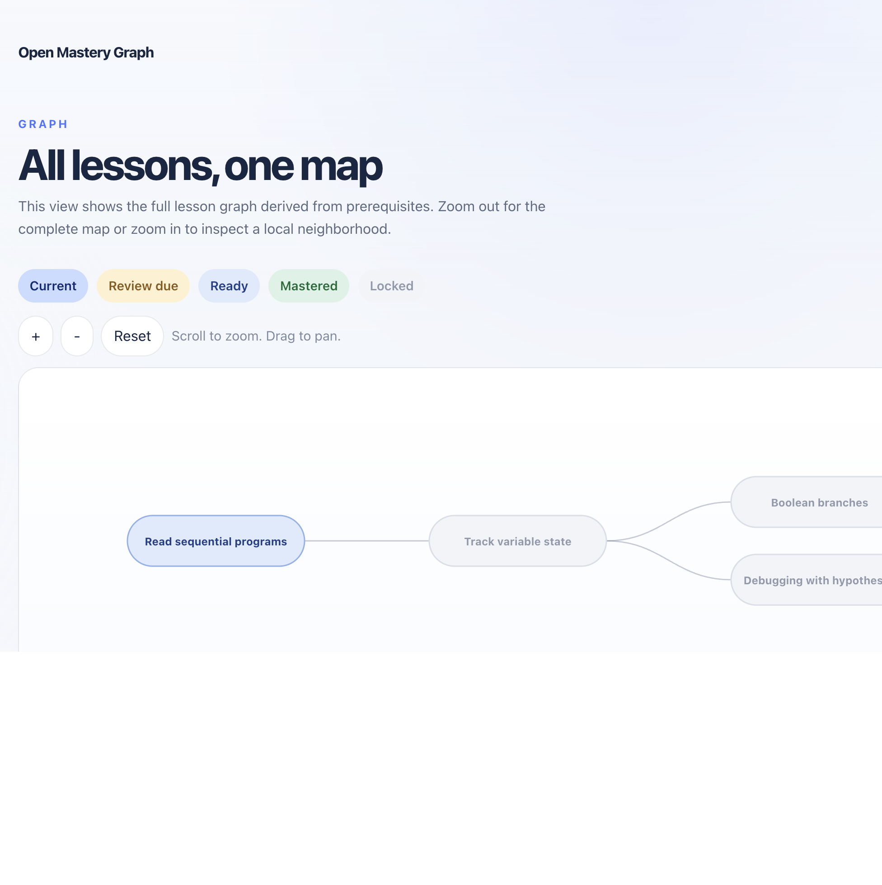

# OpenScienceBasedLearningPlatform



## Goal

This repository is building an open-source mastery-learning platform for computer science.

The long-term goal is to support:

- a skill-based learning graph
- prerequisite-aware progression
- diagnostics, lesson checks, and reviews
- community-authored content through GitHub
- a content system centered around JSON
- local-first development now, with room for accounts and persistence later

## Current Status

The repository currently contains a local frontend prototype that already includes the core direction:

- a central JSON curriculum
- tracks, modules, lessons, skills, assessments, and reviews
- prerequisite-aware lesson unlocking
- local learner progress in the browser
- a diagnostic flow
- a review queue
- a simple `Learn` view and a full zoomable `Graph` view

The current content is only example content for informatics. The structure is more important than the amount of content at this stage.

## Repository Structure

- `frontend/AnkiAICardCreationFrontend`: current frontend prototype
- `backend/AnkiAICardCreationToolboxBackend`: older backend from a previous project state
- `infrastructure`: Terraform for cloud resources
- `docs`: project documentation for the content model and contribution workflow

## Quick Start

### Run the frontend locally

```sh
cd frontend/AnkiAICardCreationFrontend
npm ci
npm run dev
```

Then open the local Vite URL shown in the terminal.

### Verify the frontend

```sh
cd frontend/AnkiAICardCreationFrontend
npm run build
npm run test:unit -- --run
```

## Frontend Architecture

### 1. Central JSON Curriculum

The curriculum currently lives in a single JSON file:

- `frontend/AnkiAICardCreationFrontend/src/content/curriculum.json`

This file drives:

- tracks
- courses/modules used internally by the graph
- skills
- lessons
- assessments
- reviews
- XP configuration

### 2. Curriculum Validation

The curriculum is validated at runtime.

Checks currently include:

- duplicate IDs
- broken references
- prerequisite cycles

Validation logic:

- `frontend/AnkiAICardCreationFrontend/src/content/validate.ts`

### 3. Learner Model

The prototype stores progress locally in the browser.

Stored state includes:

- XP
- streak
- current lesson context
- diagnostic completion
- skill state
- assessment history
- due reviews

Progress logic:

- `frontend/AnkiAICardCreationFrontend/src/lib/progress.ts`

### 4. Main UI

The UI is intentionally simple:

- `Learn`: the main daily workflow
- `Graph`: the full lesson graph with zoom and pan
- `Lesson`: lesson content and lesson check
- `Review`: due review flow

## Product Direction

The platform is being built around these core ideas:

1. open computer science learning platform
2. prerequisite graph at the skill level
3. adaptive progression and review
4. content authored in JSON
5. community contribution through pull requests
6. future support for persistence, accounts, and moderation

## Content Model

The curriculum uses a document-style JSON structure.

Top-level entities:

- `tracks`
- `courses`
- `modules`
- `skills`
- `lessons`
- `assessments`
- `reviews`
- `xp`

Core idea:

- `skills` are the main learning unit
- `lessons` teach skills
- `assessments` check skills
- `reviews` reinforce skills over time
- `modules` and `courses` organize the graph internally

More details:

- `docs/content-model.md`

## Community Content

The long-term plan is for content to be extended through pull requests in the public repository.

The main idea is:

- content should not live in Vue components
- content should live in JSON
- contributors should primarily extend the curriculum, not the UI

Current contribution notes:

- use atomic skill IDs
- keep prerequisites at the skill level
- maintain valid references between lessons, assessments, and reviews

More details:

- `docs/contributing-content.md`

## Roadmap

### Phase 1

- central JSON curriculum
- simple prerequisite-aware learning interface
- local learner progress
- example informatics content

### Phase 2

- more assessment types
- improved review scheduling
- stronger recommendation logic
- CI validation for curriculum quality

### Phase 3

- authentication and persistent user accounts
- server-side storage
- tutor/teacher views
- moderation for community content

### Phase 4

- broader informatics curriculum
- potential expansion to additional domains later

## Backend

The backend is still present in the repository, but it is not required for the current local frontend prototype.

If you still want to run it:

```sh
cd backend/AnkiAICardCreationToolboxBackend
uv sync --frozen --all-extras
uv run fastapi dev src/ankiaicardcreationtoolboxbackend/main.py
```

## Infrastructure

Terraform files are in:

- `infrastructure/`

More information:

- `infrastructure/README.md`

## Summary

To run the project locally:

1. Open the frontend directory.
2. Run `npm ci`.
3. Run `npm run dev`.
4. Explore the `Learn`, `Graph`, `Lesson`, and `Review` flows.

The most important file right now is:

- `frontend/AnkiAICardCreationFrontend/src/content/curriculum.json`
